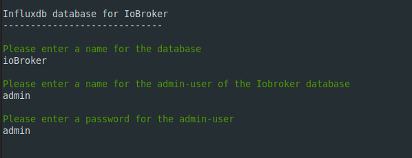
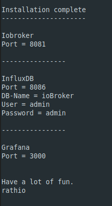

# IoBroker with InfluxDB and Grafana

This is a script to automatically install Iobroker with InfluxDB and Grafana on debian or derivate.

The script will install Iobroker native on the system, because i 
don't found a docker container for the Raspberry Pi 4.

This script will also works on normal x86 maschines.

In the script will ask you for a custom InfluxDB database-name, admin-name and admin-password




After the install, you get a summary of all the parameter you need.




To Install, you only need this line 
```
wget https://raw.githubusercontent.com/rathio-git/iobingraf/main/iobingraf && chmod +x iobingraf && ./iobingraf
```
\
\
Hope you have fun with it

rathio
